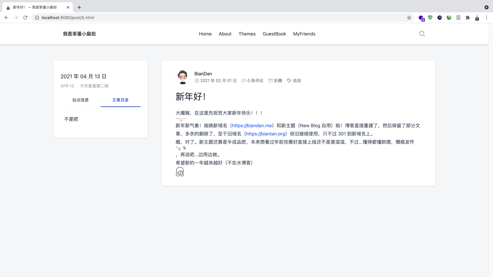
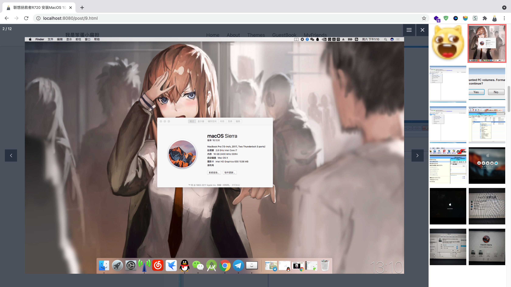
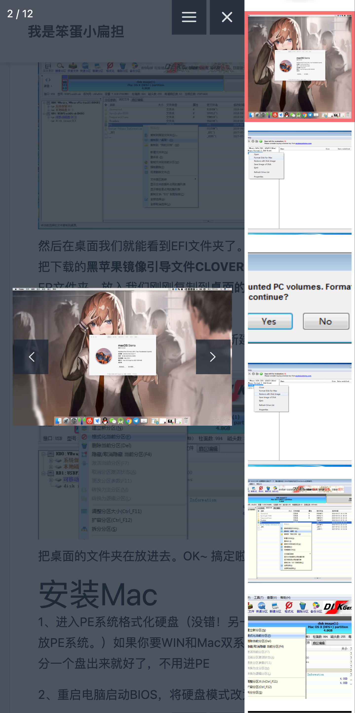
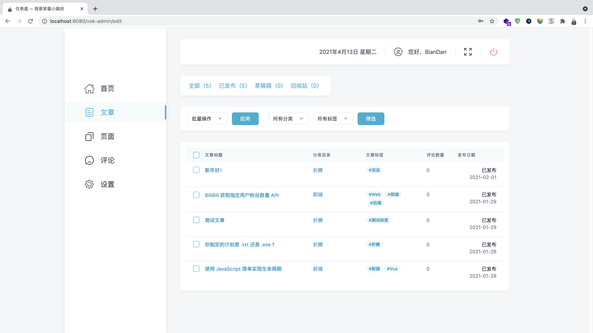
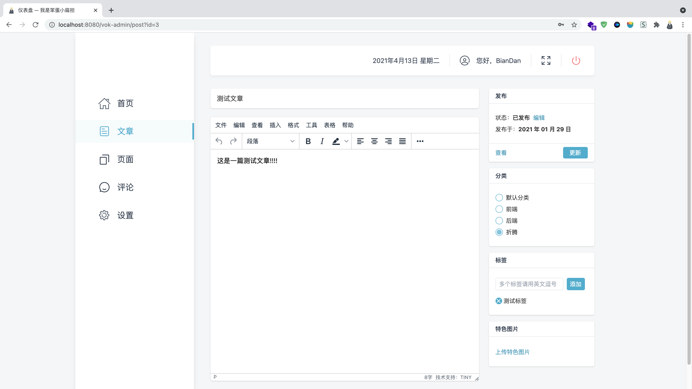

## 技术栈

Vue.js 3 + TypeScript + TailwindCSS 2.0.2 + 俺的设计
冲鸭 🦷  
在线预览  [blog.evacgn.com](https://blog.evacgn.com)

## 项目描述

这是一个基于 Vue3 + TypeScript + TailwindCSS 制作的个人博客前端项目

鸽了好久了～～ 慢慢摸出来，努力生产中

个人博客： [https://biandan.me](https://biandan.me) （目前还在使用 WordPress

Q：为什么叫 Vok ？ A：瞎写的 嘻嘻

（我直接 好家伙！）

## 预览

### 电脑端 首页

### 电脑端 文章

### 电脑端 图片灯箱

### 移动端 图片灯箱

### 电脑端 登录

### 电脑端 后台文章列表

### 电脑端 后台文章编辑

## TODO

- [x] 还算不错的 UI

### 前台：

- [x] 首页

- [x] 分类页面

- [x] 标签页面

- [x] 文章页面

- [x] 搜索页面

- [ ] 自定义页面

### 后台：

- [x] 首页

- [x] 文章管理页面

- [x] 设置页面

- [ ] 自定义管理页面

- [ ] 评论管理页面

### 更多：

- [ ] 夜间模式
